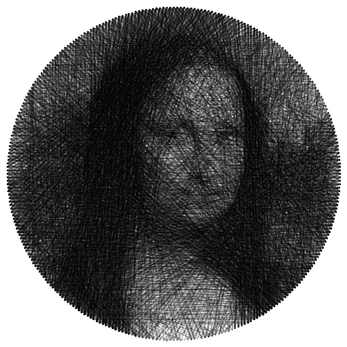

# ThreadArt

This project aims to create string art instructions from a given image.  
String art is a technique where nails or pins are arranged on a surface, and string or thread is wound around the nails to form geometric patterns or images.

## Features
This program adds several utilities to the basic instruction generator:

- Image cropper with color correction
- Batched generation to easily find the best parameters for an image
- Random variation generator to refine a particular result

## Examples

Generated examples :

  
  
  
  
  

  
  

  
  

   

Real world example :

  
  

## Usage
1. Place the image you want to convert into the input directory within the source folder
2. Run the ThreadArt.py script
3. Adjust the parameters as needed to match the image as closely as possible. You can find the parameters in the Config class from the ThreadArt.py file
4. Once the program completes execution, it will generate string art instructions in a text file named lastPath.txt within the Paths directory and the image result in the Outputs directory

## Requirements

Ensure you have the following prerequisites installed before running the project:

- [Python 3](https://www.python.org/downloads/) or later
- [Tkinter](https://docs.python.org/3/library/tkinter.html) (Included with Python standard library)

## Contributions

Contributions are welcome!
Whether you're interested in fixing bugs, adding features, or improving documentation, feel free to submit a pull request.

## License & Acknowledgement

This project is based on the work of [halfmonty](https://github.com/halfmonty/StringArtGenerator)

This project is licensed under the MIT License - see the LICENSE file for details.
